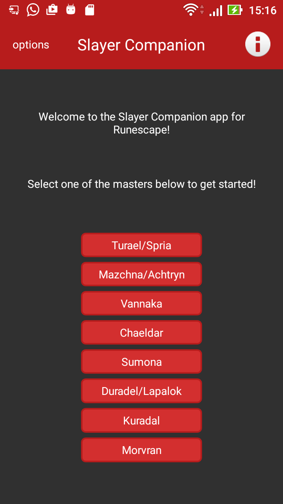

# SlayerCompanion

Application created to aid Runescape players during slayer tasks.

It will provide the following information, for **every task**:

* Slayer and combat experience gained per task
* Expected gp per task
* Expected charms per task

The current landing screen:

**WARNING**
Development is currently ***halted*** until [RSAppCentral](https://github.com/JPCMarques/RSAppCentral) is complete, as [RSAppModules](https://github.com/JPCMarques/RSAppModules) is not Android compliant. The new library will be less specific and, ironically, *more* modular. 
